# Journal Club 学期汇总

## 空间转录组相关

 
  
### 数据整合/对齐

**1**  [`Partial alignment of multislice spatially resolved transcriptomics data`](https://www.biorxiv.org/content/10.1101/2023.01.08.523162v1.full.pdf)

**期刊/时间** `Genome reserch / 2023 10` 

**关键词** `Alignment of spatial transcriptomics`  `PASTE2`

**问题描述** 对齐空间转录组数据的方法，是之前的PASTE的进一步工作，考虑了空间转录组切片只有部分对齐的情况

PASTE在进行切片对齐时假设两个切片可以在整体的2D切片内（所有点）进行对齐。即两个切片整体在生理上、技术上都具有高度的相似性。然而这通常并不是一个合理的假设，因为组织解剖和阵列（捕获区）放置在一致性上存在技术困难，并且相邻切片之间组织形态可能也难免存在差异。有时可能相邻切片之间沿z轴（垂直于切片的轴）只有部分组织重叠:

s被认为是表示两切片之间重叠占比的参数，当g_i=1/n时，将有占比大约为s的细胞参与了对齐。

**2**  [`STalign: Alignment of spatial transcriptomics data using diffeomorphic metric mapping`](https://www.nature.com/articles/s41467-023-43915-7)

**期刊/时间** `Nature Communications / 2023 12` 

**关键词** `Alignment of spatial transcriptomics`  `LDDMM`

**问题描述** 使用一个现有的图像映射算法LDDMM来对齐空间转录组数据
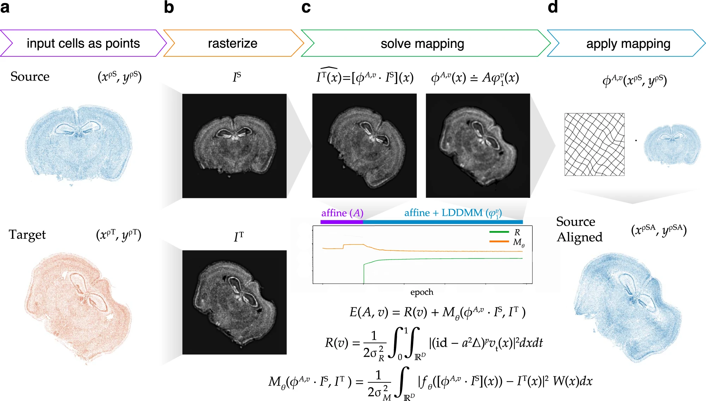

**3**  [SPIRAL: integrating and aligning spatially resolved transcriptomics data across different experiments, conditions, and technologies](https://genomebiology.biomedcentral.com/articles/10.1186/s13059-023-03078-6)

**期刊/时间** `Nature Computational Science  / 2023 10` 

**关键词** `integrating and aligning of spatial transcriptomics` `SPIRAL`

**问题描述** SPIRAL 由两个连续模块组成： SPIRAL-integration（基于图域适应的数据集成）和 SPIRAL-alignment（基于集群感知的优化传输协调对齐）
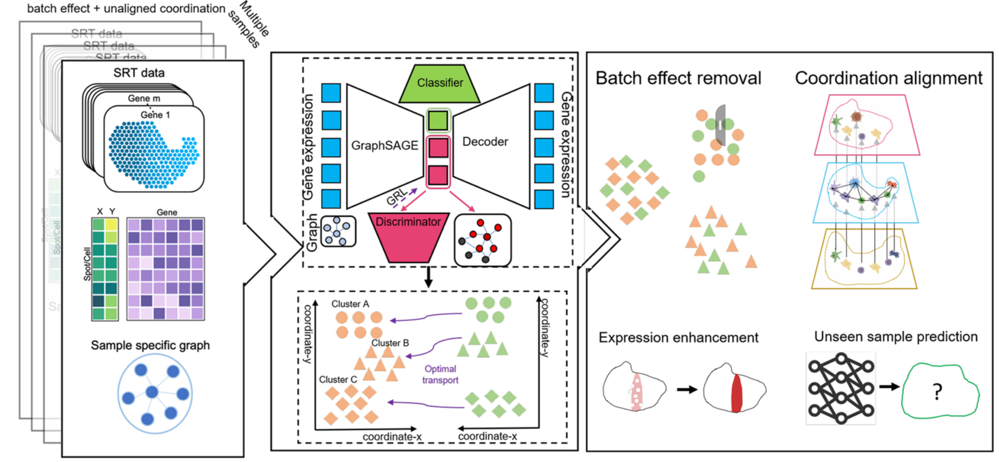

**4**  [Integrating spatial transcriptomics data across different conditions, technologies and developmental stages](https://www.biorxiv.org/content/10.1101/2022.12.26.521888v1.full.pdf)

**期刊/时间** `Nature Computational Science  / 2023 10` 

**关键词** `Integrating spatial transcriptomics data` `STAligner`

**问题描述** STAligner 的图注意神经网络，用于整合和对齐 ST 数据集，实现空间感知数据整合、同步空间域识别和下游比较分析。
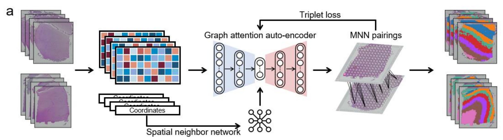

**5**  [`Latent feature extraction with a prior-based self-attention framework for spatial transcriptomics`](https://genome.cshlp.org/content/33/10/1757.full)

**期刊/时间** `Genome reserch / 2023 10` 

**关键词** `Latent feature extraction` `self- attention`  `PAST`

**问题描述** 基于自注意力框架来提取空间转录组数据的潜在特征
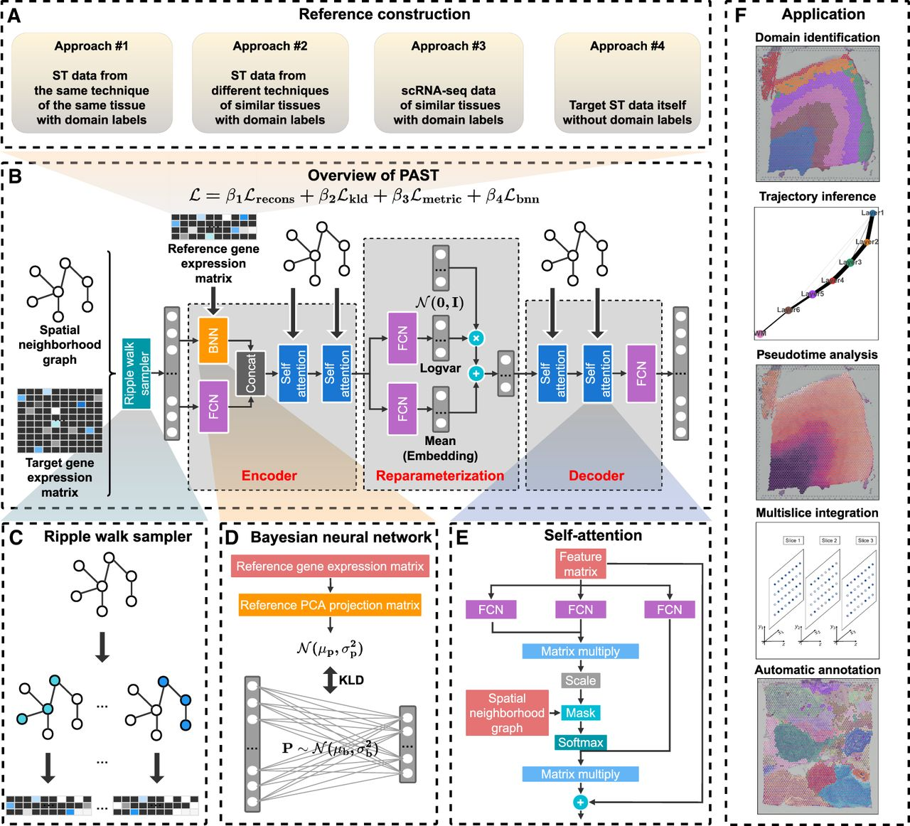

**6**  [`MUSTANG: multi-sample spatial transcriptomics data analysis with cross-sample transcriptional similarity guidance`](https://www.biorxiv.org/content/10.1101/2023.09.08.556895v1.full.pdf)

**期刊/时间** `bioRxiv /2023.09` 

**关键词** `transcriptomics data analysis` `grouped horseshoe distribution` `spot similarity graph` `MUSTANG`

**问题描述** 空间转录组数据整合分析，最终得到的是所有spot的新的表示，并不强调空间坐标对应

 
  
### 空间域/空间可变基因识别 

  
**1**  [`STAMarker: determining spatial domain-specific variable genes with saliency maps in deep learning`](https://www.biorxiv.org/content/10.1101/2022.11.07.515535v1.full.pdf)

**期刊/时间** `Nucleic Acids Research / 2023.10` 

**关键词** `graph-attention autoencoders` `multilayer perceptron classifiers` `saliency map computation`

**问题描述** 识别特定于空间域的空间可变基因
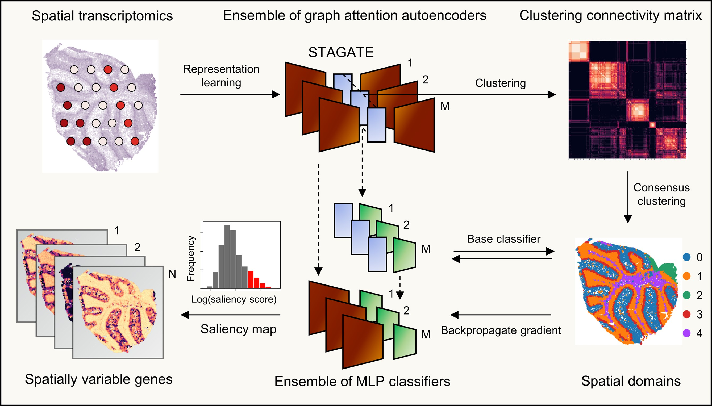

**2**  [`Probabilistic cell / domain-type assignment of spatial transcriptomics data with SpatialAnno`](https://www.biorxiv.org/content/10.1101/2023.02.08.527590v1.full.pdf)

**期刊/时间** `Nucleic Acids Research / 2023.11` 

**关键词** `factor model` `Potts model`

**问题描述** 利用大量非标记基因以及有关标记基因的“定性”信息进行空间转录组数据集注释
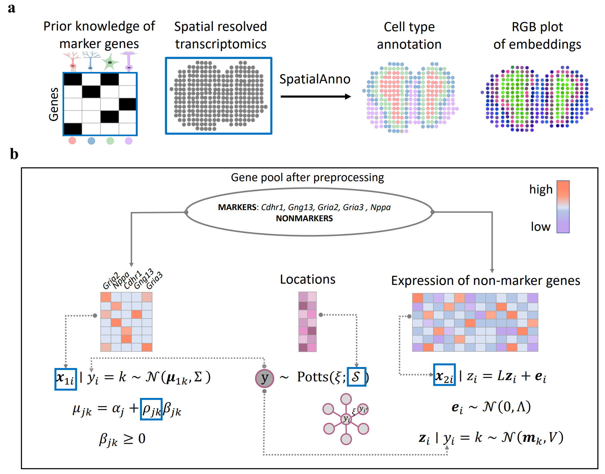

**3**  [`Mapping the topography of spatial gene expression with interpretable deep learning`](https://www.biorxiv.org/content/10.1101/2023.10.10.561757v1.full.pdf)

**期刊/时间** `bioRxiv /2023.10` 

**关键词** `Isodepth` `spatial transcriptomics data` `spatial domain` `GASTON`

**问题描述** 从 SRT 数据中识别具有空间变化表达的空间域和/或基因
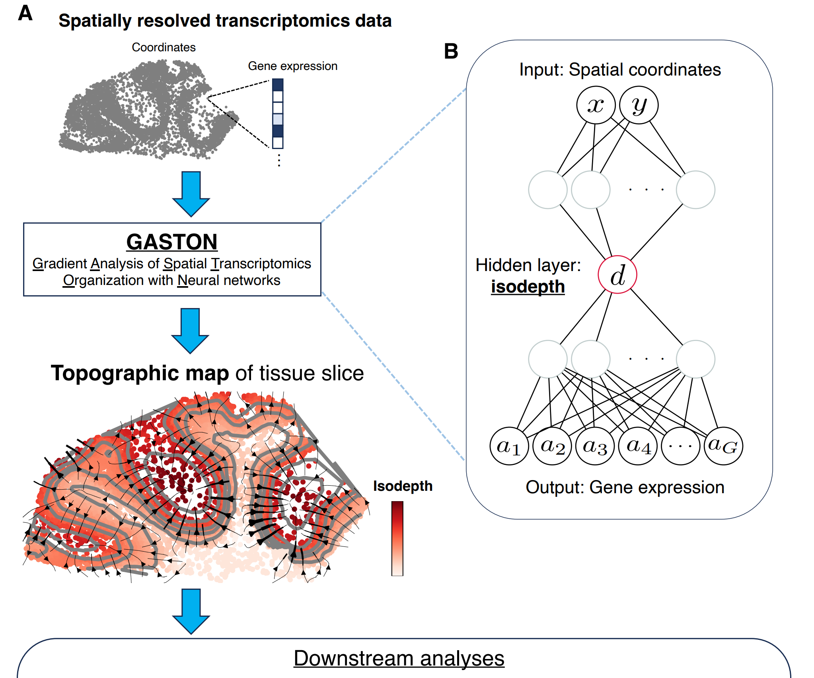

 
  
### 空间定位 

  
**1**  [`Leveraging spatial transcriptomics data to recover cell locations in single-cell RNA-seq with CeLEry`](https://www.biorxiv.org/content/10.1101/2022.11.07.515535v1.full.pdf)

**期刊/时间** `Nature communications  /2023.07` 

**关键词** `Spatial transcriptomics` `scRNA-seq` `cell location recovery`

**问题描述** 通过学习单细胞转录组和空间位置之间的关系，利用单细胞的基因表达信息来预测其位置信息
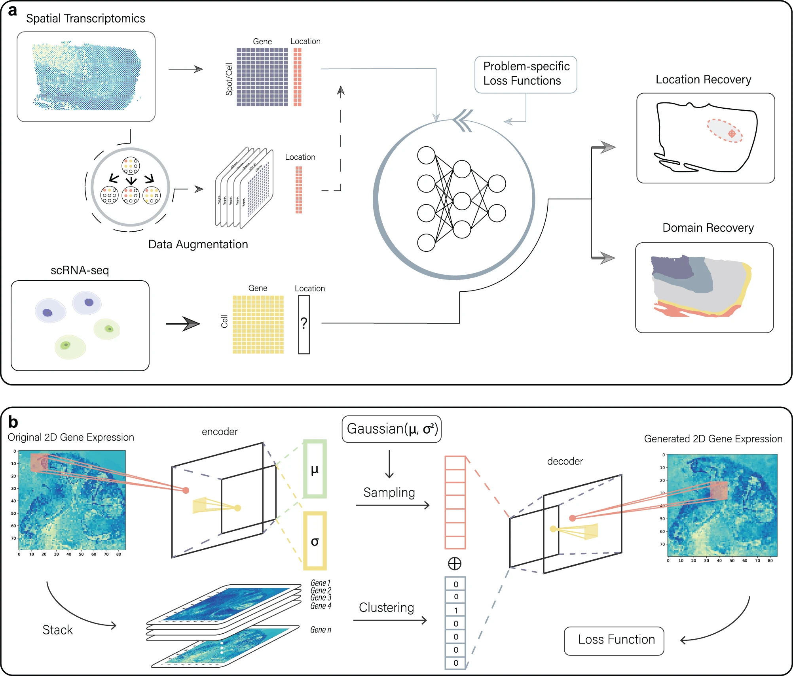

**2**  [`SiGra: single-cell spatial elucidation through an image-augmented graph transformer`](https://www.biorxiv.org/content/10.1101/2023.02.08.527590v1.full.pdf)

**期刊/时间** `Nature communications / 2023.09` 

**关键词** `Spatial transcriptomics` `Graph transformer` `Multimodal data`

**问题描述** 利用多通道免疫组化图像和基因表达数据，通过图卷积神经网络的方式，对细胞进行空间定位和分类
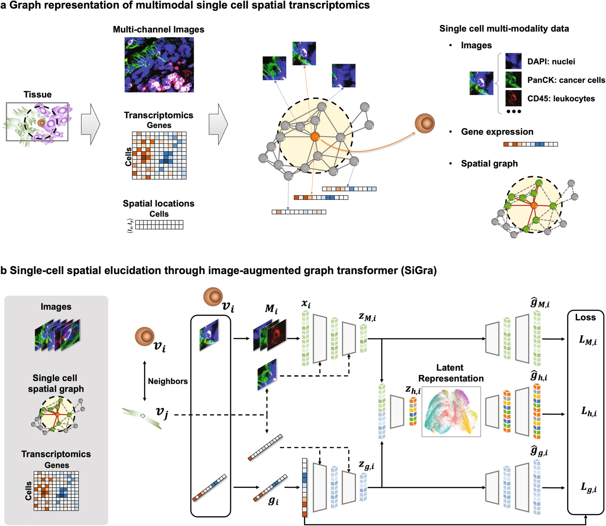

 
  
### 解卷积 

**1**  [`GTM-decon: guided-topic modeling of single-cell transcriptomes enables sub-cell-type and disease-subtype deconvolution of bulk transcriptomes`](https://www.biorxiv.org/content/10.1101/2022.11.07.515535v1.full.pdf)

**期刊/时间** `Genome Biology / 2023.08` 

**关键词** `Alignment of spatial transcriptomics` `PASTE2`

**问题描述** 用于解卷积的引导主题模型（GTM-decon），能从单细胞 RNA-seq 数据中自动推断细胞类型特异性基因主题分布，用于解卷积批量转录组

## 单细胞相关

 
  
### 多组学/多模态数据整合

**1**  [`Integration of gene expression and DNA methylation data across different experiments`](https://www.biorxiv.org/content/10.1101/2022.11.07.515535v1.full.pdf)

**期刊/时间** `Nucleic Acids Research  /2023.07` 

**关键词** `MO/MD problem` `predictive model` `DNA methylation data`

**问题描述** 通过学习一个根据甲基化数据预测基因表达的模型来进行数据整合

**2**  [`Integration of spatial and single-cell data across modalities with weakly linked features`](https://www.biorxiv.org/content/10.1101/2023.02.08.527590v1.full.pdf)

**期刊/时间** `Nature Biotechnology / 2023.09` 

**关键词** `weak linkage`  `fuzzy smoothed embedding`

**问题描述** 通过迭代共嵌入、数据平滑和细胞匹配，使用每个模态中的所有信息来获得数据集成

**3**  [`Stabilized mosaic single-cell data integration using unshared feature`](https://www.biorxiv.org/content/10.1101/2023.10.10.561757v1.full.pdf)

**期刊/时间** `Nature Biotechnology / 2023.05` 

**关键词** `non-overlapping features` `multi-hop`

**问题描述** 在共享特征的基础上，利用非共享特征来稳定单细胞数据的整合

**4**  [`Multi-task learning from multimodal single-cell omics with Matilda`](https://www.biorxiv.org/content/10.1101/2023.10.10.561757v1.full.pdf)

**期刊/时间** `Nucleic Acids Research / 2023.10` 

**关键词** `VAE` `fully-connected classification network`

**问题描述** 用于多模态单细胞组学数据综合分析的多任务学习方法。通过利用任务之间的相互关系，在单个统一框架中执行数据模拟、降维、细胞类型分类和特征选择。

**5**  [`scMultiSim: simulation of multi-modality single cell data guided by cell-cell interactions and gene regulatory networks`](https://www.biorxiv.org/content/10.1101/2023.10.10.561757v1.full.pdf)

**期刊/时间** `Preprint / 2023.03` 

**关键词** `simulation of multi-modality single cell data` `scMultiSim`

**问题描述** 模拟生成单细胞多模态数据的方法
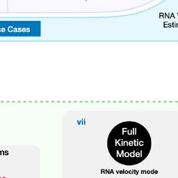

**6**  [`Integrating SNVs and CNAs on a phylogenetic tree from single-cell DNA sequencing data`](https://www.biorxiv.org/content/10.1101/2023.10.10.561757v1.full.pdf)

**期刊/时间** `Genome reserch / 2023.11` 

**关键词** `Single-cell DNA sequencing` `evolutionary trees` `SNVs and CNAs integration`

**问题描述** 将 SNV 和 CNA 整合到单细胞 DNA 测序数据的系统发育树上，得到一个更全面完整的系统发育树

**7**  [`Mapping disease regulatory circuits at cell-type resolution from single-cell multiomics data`](https://www.biorxiv.org/content/10.1101/2023.10.10.561757v1.full.pdf)

**期刊/时间** `Nature computationalscience / 2023.06` 

**关键词** `Circuit chromatin sites` `scATAC-seq` `scRNA-seq`

**问题描述** 整合了来自不同条件的scRNA-seq和scATAC-seq数据，以识别与疾病相关的转录因子、染色质位点和基因作为调控回路

**8**  [`scBridge embraces cell heterogeneity in single-cell RNA-seq and ATAC-seq data integration`](https://www.biorxiv.org/content/10.1101/2023.10.10.561757v1.full.pdf)

**期刊/时间** `Nature communications / 2023.09` 

**关键词** `iterative integration` `heterogeneous transfer learning`

**问题描述** 整合scRNA-seq和scATAC-seq数据,减少组学数据之间的差异，同时保留细胞类型之间的差异

**8**  [`CMOT: Cross-Modality Optimal Transport for multimodal inference`](https://www.biorxiv.org/content/10.1101/2023.10.10.561757v1.full.pdf)

**期刊/时间** `Genome Biology / 2023.07` 

**关键词** `data integration` `Optimal Transport`  `CMOT`

**问题描述** CMOT将现有多模态数据中的细胞对齐到一个共同的潜在空间，并从映射源细胞的另一种模态（目标）中推断细胞缺失的模态
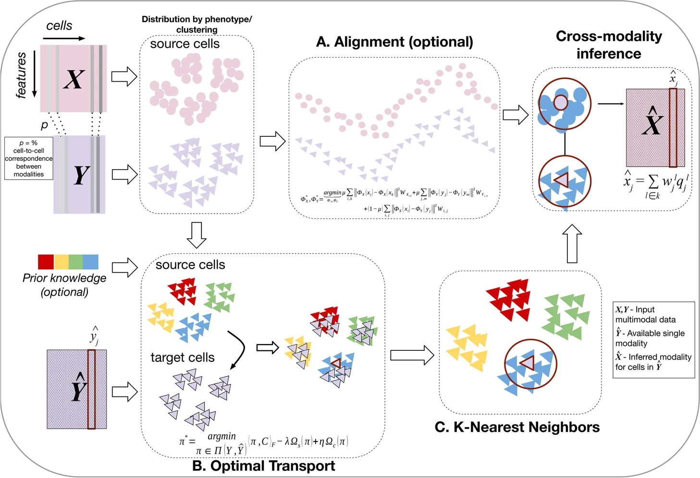

 
  
### RNA速率

 
  
### 基因调控

**1**  [`Predicting the impact of sequence motifs on gene regulation using single-cell data`](https://genomebiology.biomedcentral.com/articles/10.1186/s13059-023-03021-9)

**期刊/时间** `Genome Biology / 2023.08` 

**关键词** `deconvolution` `Cell-type composition` `GTM-decon`

**问题描述** 利用在单细胞数据上训练的卷积神经网络，推断调控基调和细胞类型特异性的重要性

## 蛋白质组学相关

 
  
### 蛋白质生成

 
  
### 受配体对

**1**  [`Computing the relative binding affinity of ligands based on a pairwise binding comparison network`](https://genomebiology.biomedcentral.com/articles/10.1186/s13059-023-03021-9)

**期刊/时间** `Nature Computational Science /2023.10` 

**关键词** `binding affinity prediction` `congeneric ligands` `PBCNet`

**问题描述** 一种基于物理信息图注意机制的配对结合比较网络（PBCNet），专门用于同源配体之间相对结合亲和力的排序
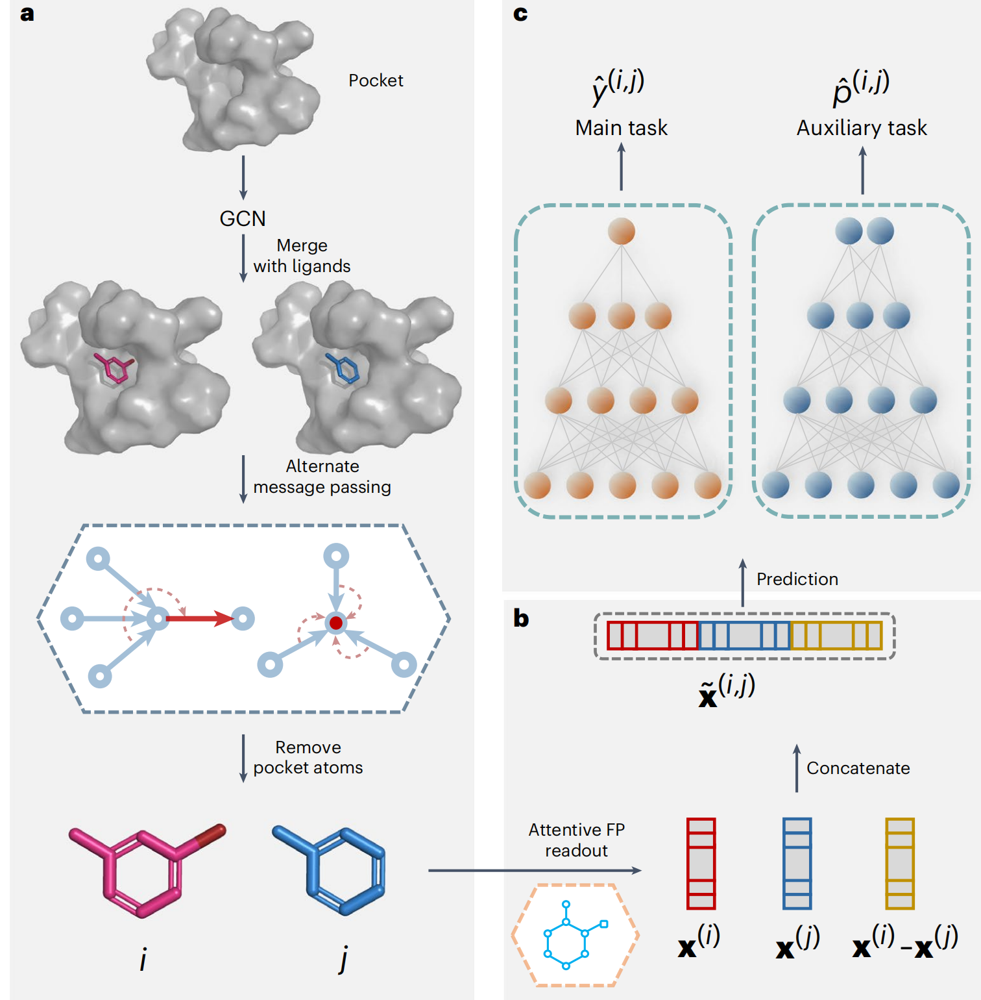

