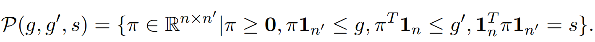

# Journal Club 学期汇总

## 空间转录组相关

### 数据整合/对齐

**1**  [`Partial alignment of multislice spatially resolved transcriptomics data`](https://www.biorxiv.org/content/10.1101/2023.01.08.523162v1.full.pdf)

**期刊/时间** `Genome reserch / 2023 10` 

**关键词** `Alignment of spatial transcriptomics`  `PASTE2`

**问题描述** 对齐空间转录组数据的方法，是之前的PASTE的进一步工作，考虑了空间转录组切片只有部分对齐的情况

PASTE在进行切片对齐时假设两个切片可以在整体的2D切片内（所有点）进行对齐。即两个切片整体在生理上、技术上都具有高度的相似性。然而这通常并不是一个合理的假设，因为组织解剖和阵列（捕获区）放置在一致性上存在技术困难，并且相邻切片之间组织形态可能也难免存在差异。有时可能相邻切片之间沿z轴（垂直于切片的轴）只有部分组织重叠:

s被认为是表示两切片之间重叠占比的参数，当g_i=1/n时，将有占比大约为s的细胞参与了对齐。

**2**  [`Latent feature extraction with a prior-based self-attention framework for spatial transcriptomics`](https://genome.cshlp.org/content/33/10/1757.full)

**期刊/时间** `Genome reserch / 2023 10` 

**关键词** `Latent feature extraction` `self- attention`  `PAST`

**问题描述** 基于自注意力框架来提取空间转录组数据的潜在特征

**3**  [`STalign: Alignment of spatial transcriptomics data using diffeomorphic metric mapping`](https://www.nature.com/articles/s41467-023-43915-7)

**期刊/时间** `Nature Communications / 2023 12` 

**关键词** `Alignment of spatial transcriptomics`  `LDDMM`

**问题描述** 使用一个现有的图像映射算法LDDMM来对齐空间转录组数据

[MUSTANG: multi-sample spatial transcriptomics data analysis with cross-sample transcriptional similarity guidance](https://www.biorxiv.org/content/10.1101/2023.09.08.556895v1.full.pdf)
