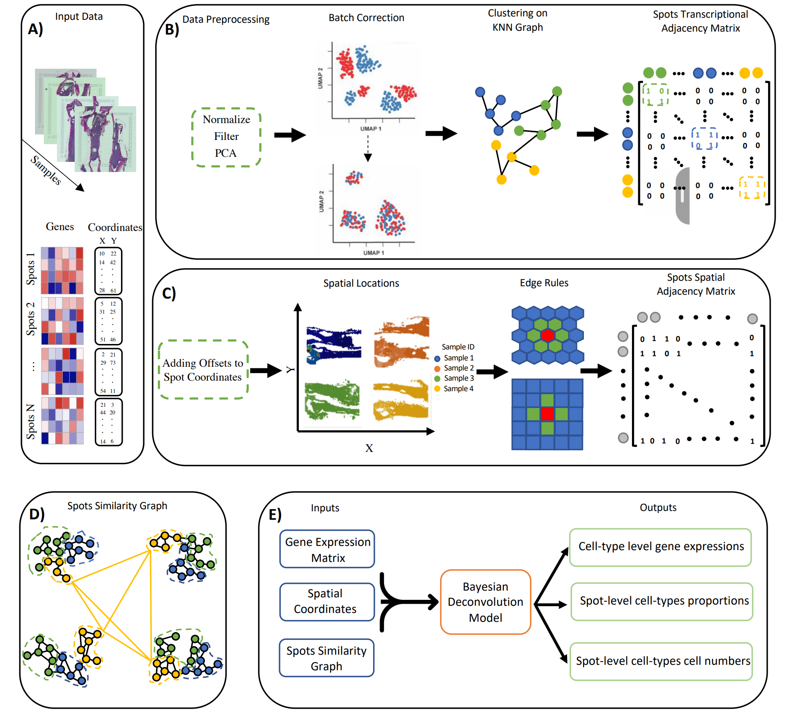
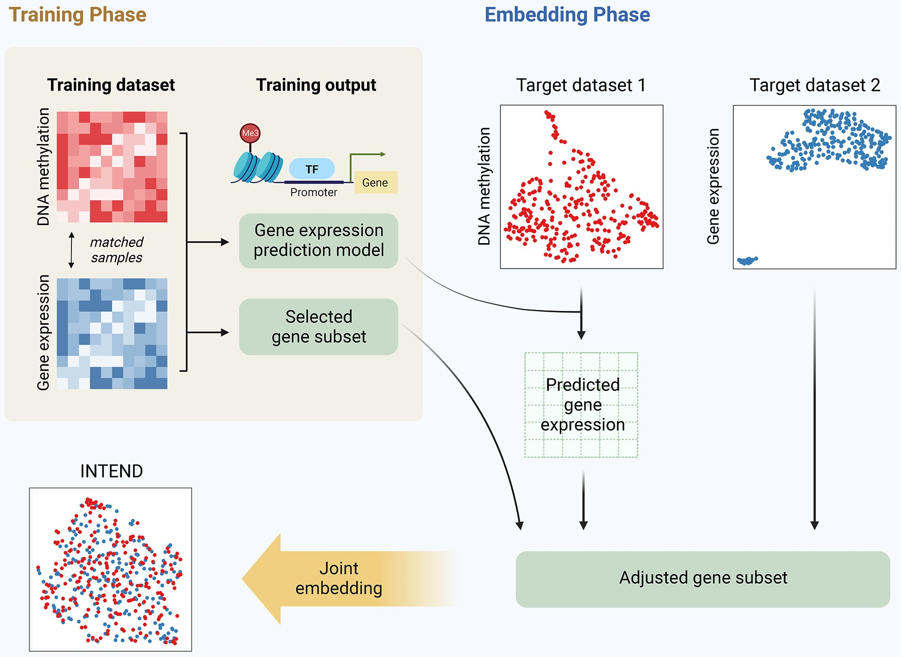
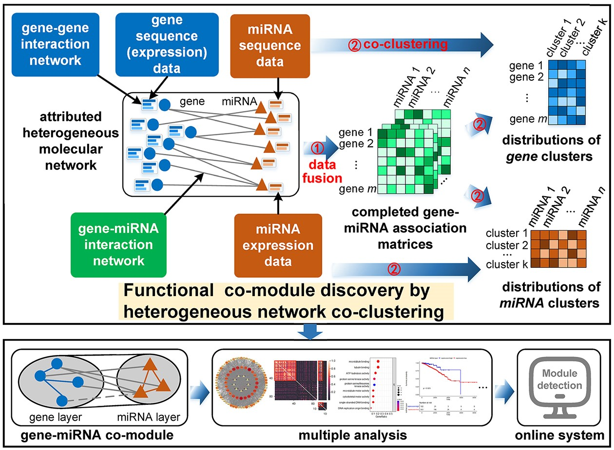
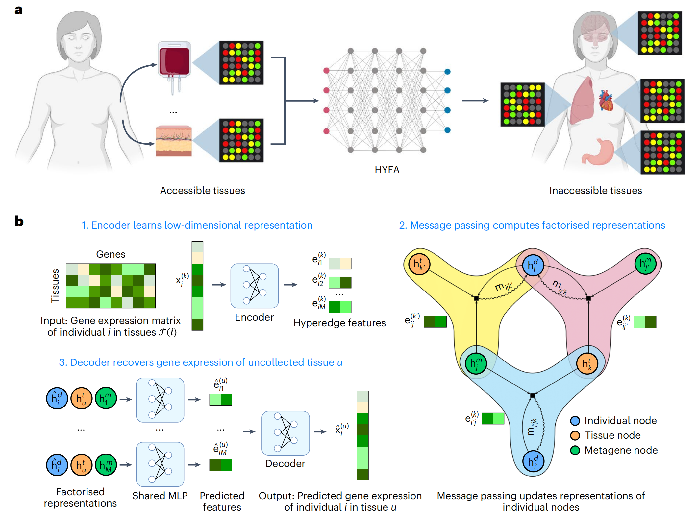

# Journal Club 学期汇总

## 空间转录组相关

 
  
### 数据整合/对齐

**1**  [`Partial alignment of multislice spatially resolved transcriptomics data`](https://www.biorxiv.org/content/10.1101/2023.01.08.523162v1.full.pdf)

**期刊/时间** `Genome reserch / 2023 10` 

**关键词** `Alignment of spatial transcriptomics`  `PASTE2`

**问题描述** 对齐空间转录组数据的方法，是之前的PASTE的进一步工作，考虑了空间转录组切片只有部分对齐的情况

PASTE在进行切片对齐时假设两个切片可以在整体的2D切片内（所有点）进行对齐。即两个切片整体在生理上、技术上都具有高度的相似性。然而这通常并不是一个合理的假设，因为组织解剖和阵列（捕获区）放置在一致性上存在技术困难，并且相邻切片之间组织形态可能也难免存在差异。有时可能相邻切片之间沿z轴（垂直于切片的轴）只有部分组织重叠:

 paste2 

s被认为是表示两切片之间重叠占比的参数，当g_i=1/n时，将有占比大约为s的细胞参与了对齐。

**2**  [`STalign: Alignment of spatial transcriptomics data using diffeomorphic metric mapping`](https://www.nature.com/articles/s41467-023-43915-7)

**期刊/时间** `Nature Communications / 2023 12` 

**关键词** `Alignment of spatial transcriptomics`  `LDDMM` `STalign`

**问题描述** 使用一个现有的图像映射算法LDDMM来对齐空间转录组数据

 STalign 

**3**  [`Alignment of spatial genomics data using deep Gaussian processes`](https://www.nature.com/articles/s41592-023-01972-2)

**期刊/时间** `Nature Methods  / 2023 08` 

**关键词** `integrating and aligning of spatial transcriptomics` `deep Gaussian processes`

**问题描述** 基于深度高斯过程对齐空间转录组数据

 deep GP 

**4**  [SPIRAL: integrating and aligning spatially resolved transcriptomics data across different experiments, conditions, and technologies](https://genomebiology.biomedcentral.com/articles/10.1186/s13059-023-03078-6)

**期刊/时间** `Nature Computational Science  / 2023 10` 

**关键词** `integrating and aligning of spatial transcriptomics` `SPIRAL`

**问题描述** SPIRAL 由两个连续模块组成： SPIRAL-integration（基于图域适应的数据集成）和 SPIRAL-alignment（基于集群感知的优化传输协调对齐）

 SPIRAL 

**5**  [Integrating spatial transcriptomics data across different conditions, technologies and developmental stages](https://www.biorxiv.org/content/10.1101/2022.12.26.521888v1.full.pdf)

**期刊/时间** `Nature Computational Science  / 2023 10` 

**关键词** `Integrating spatial transcriptomics data` `STAligner`

**问题描述** STAligner 的图注意神经网络，用于整合和对齐 ST 数据集，实现空间感知数据整合、同步空间域识别和下游比较分析。

 STAligner 

**6**  [`Latent feature extraction with a prior-based self-attention framework for spatial transcriptomics`](https://genome.cshlp.org/content/33/10/1757.full)

**期刊/时间** `Genome reserch / 2023 10` 

**关键词** `Latent feature extraction` `self- attention`  `PAST`

**问题描述** 基于自注意力框架来提取空间转录组数据的潜在特征

 past 

**7**  [`MUSTANG: multi-sample spatial transcriptomics data analysis with cross-sample transcriptional similarity guidance`](https://www.biorxiv.org/content/10.1101/2023.09.08.556895v1.full.pdf)

**期刊/时间** `bioRxiv /2023.09` 

**关键词** `transcriptomics data analysis` `grouped horseshoe distribution` `spot similarity graph` `MUSTANG`

**问题描述** 空间转录组数据整合分析，最终得到的是所有spot的新的表示，并不强调空间坐标对应

 MUSTANG 

**8**  [`Construction of a 3D whole organism spatial atlas by joint modelling of multiple slices with deep neural networks`](https://www.nature.com/articles/s42256-023-00734-1)

**期刊/时间** `Nature Machine Intelligence /2023.10` 

**关键词** `transcriptomics data analysis` `STitch3D`

**问题描述** 空间转录组数据整合分析，构建3D-graph

 STitch3D 

 
  
### 空间域/空间可变基因识别 

  
**1**  [`STAMarker: determining spatial domain-specific variable genes with saliency maps in deep learning`](https://www.biorxiv.org/content/10.1101/2022.11.07.515535v1.full.pdf)

**期刊/时间** `Nucleic Acids Research / 2023.10` 

**关键词** `graph-attention autoencoders` `multilayer perceptron classifiers` `saliency map computation`

**问题描述** 识别特定于空间域的空间可变基因

 STAMarker 

**2**  [`Probabilistic cell / domain-type assignment of spatial transcriptomics data with SpatialAnno`](https://www.biorxiv.org/content/10.1101/2023.02.08.527590v1.full.pdf)

**期刊/时间** `Nucleic Acids Research / 2023.11` 

**关键词** `factor model` `Potts model`

**问题描述** 利用大量非标记基因以及有关标记基因的“定性”信息进行空间转录组数据集注释

 SpatialAnno 

**3**  [`Mapping the topography of spatial gene expression with interpretable deep learning`](https://www.biorxiv.org/content/10.1101/2023.10.10.561757v1.full.pdf)

**期刊/时间** `bioRxiv /2023.10` 

**关键词** `Isodepth` `spatial transcriptomics data` `spatial domain` `GASTON`

**问题描述** 从 SRT 数据中识别具有空间变化表达的空间域和/或基因

 GASTON 

**4**  [`nnSVG for the scalable identification of spatially variable genes using nearest-neighbor Gaussian processes`](https://www.nature.com/articles/s41467-023-39748-z)

**期刊/时间** `Nature Communications / 2023.07` 

**关键词** `spatially variable genes` `nearest-neighbor Gaussian processes`

**问题描述** 基于高斯过程寻找空间可变基因

 
  
### 空间定位 

  
**1**  [`Leveraging spatial transcriptomics data to recover cell locations in single-cell RNA-seq with CeLEry`](https://www.nature.com/articles/s41467-023-39895-3)

**期刊/时间** `Nature communications  /2023.07` 

**关键词** `Spatial transcriptomics` `scRNA-seq` `cell location recovery`

**问题描述** 通过学习单细胞转录组和空间位置之间的关系，利用单细胞的基因表达信息来预测其位置信息

 CeLEry 

**2**  [`SiGra: single-cell spatial elucidation through an image-augmented graph transformer`](https://www.nature.com/articles/s41467-023-41437-w)

**期刊/时间** `Nature communications / 2023.09` 

**关键词** `Spatial transcriptomics` `Graph transformer` `Multimodal data`

**问题描述** 利用多通道免疫组化图像和基因表达数据，通过图卷积神经网络的方式，对细胞进行空间定位和分类

 SiGra 

 
  
### 解卷积 

**1**  [`GTM-decon: guided-topic modeling of single-cell transcriptomes enables sub-cell-type and disease-subtype deconvolution of bulk transcriptomes`](https://genomebiology.biomedcentral.com/articles/10.1186/s13059-023-03034-4)

**期刊/时间** `Genome Biology / 2023.08` 

**关键词** `deconvolution` `Cell-type composition` `GTM-decon`

**问题描述** 用于解卷积的引导主题模型（GTM-decon），能从单细胞 RNA-seq 数据中自动推断细胞类型特异性基因主题分布，用于解卷积批量转录组

 GTM-decon 

**2**  [`SCS: cell segmentation for high-resolution spatial transcriptomics`](https://www.nature.com/articles/s41592-023-01939-3)

**期刊/时间** `Nature Methods / 2022.12` 

**关键词** `deconvolution` `cell segmentation` `SCS`

**问题描述** 类似解卷积（spot与cell地位对调）

 SCS 

**3**  [`GeneSegNet: a deep learning framework for cell segmentation by integrating gene expression and imaging`](https://genomebiology.biomedcentral.com/articles/10.1186/s13059-023-03054-0)

**期刊/时间** `Genome Biology / 2023.10` 

**关键词** `cell segmentation` `identify cell boundary` `GeneSegNet`

**问题描述** 基于深度学习的方法--GeneSegNet，能整合基因表达和成像信息来进行细胞分割

 GeneSegNet 

 
  
### 细胞通讯 

**1**  [`SpatialDM for rapid identification of spatially co-expressed ligand–receptor and revealing cell–cell communication patterns`](https://www.nature.com/articles/s41467-023-39608-w)

**期刊/时间** `Nature Methods / 2023.11` 

**关键词** `temporal and spatial omics data` `review`

**问题描述** 利用双变量 Moran 统计来检测空间共表达的配体和受体对、它们的局部相互作用点（单点分辨率）和通信模式。SpatialDM 揭示了一些通信模式并识别了条件之间的差异相互作用，从而能够发现特定环境的细胞合作和信号传导。

 SpatialDM 

**2**  [`Inferring ligand-receptor cellular networks from bulk and spatial transcriptomic datasets with BulkSignalR`](https://www.ncbi.nlm.nih.gov/pmc/articles/PMC10250239/pdf/gkad352.pdf)

**期刊/时间** `Nucleic Acids Research / 2023.05` 

**关键词** `ligand-receptor interactions` `downstream pathways`

**问题描述** 将配体-受体相互作用与下游通路整合以在bulk和空间转录组数据上推断配受体细胞网络

 BulkSignalR 

 
  
### 其它 

**1**  [`Principles and challenges of modeling temporal and spatial omics data`](https://www.nature.com/articles/s41592-023-01992-y)

**期刊/时间** `Nature Methods / 2023.09` 

**关键词** `temporal and spatial omics data` `review`

**问题描述** 概述了时间和空间组学数据分析的共同原则和挑战。讨论了建模时间和空间相关性的统计概念，并强调了将现有分析方法应用于具有时间和空间维度的数据的机会。

**2**  [`BayesTME: An end-to-end method for multiscale spatial transcriptional profiling of the tissue microenvironment`](https://www.sciencedirect.com/science/article/pii/S2405471223001564)

**期刊/时间** `Cell system / 2023.07` 

**关键词** `comprehensive analysis of spatial transcriptomics` `bleed correction` `cell type deconvonlution` `spatial transcriptional programs` `BayesTME`

**问题描述** 综合分析空间转录组数据，一个比较全面的研究流程

## 单细胞相关

 
  
### 多组学/多模态数据整合

**1**  [`Integration of gene expression and DNA methylation data across different experiments`](https://academic.oup.com/nar/article/51/15/7762/7217038)

**期刊/时间** `Nucleic Acids Research  /2023.07` 

**关键词** `MO/MD problem` `predictive model` `DNA methylation data` `INTEND`

**问题描述** 通过学习一个根据甲基化数据预测基因表达的模型来进行数据整合

 INTEND 

**2**  [`Integration of spatial and single-cell data across modalities with weakly linked features`](https://www.nature.com/articles/s41587-023-01935-0)

**期刊/时间** `Nature Biotechnology / 2023.09` 

**关键词** `weak linkage`  `fuzzy smoothed embedding` `MaxFuse`

**问题描述** 通过迭代共嵌入、数据平滑和细胞匹配，使用每个模态中的所有信息来获得数据集成

 MaxFuse 

**3**  [`Stabilized mosaic single-cell data integration using unshared feature`](https://www.nature.com/articles/s41587-023-01766-z)

**期刊/时间** `Nature Biotechnology / 2023.05` 

**关键词** `non-overlapping features` `multi-hop` `StabMap`

**问题描述** 在共享特征的基础上，利用非共享特征来稳定单细胞数据的整合

 StabMap 

**4**  [`Multi-task learning from multimodal single-cell omics with Matilda`](Multi-task learning from multimodal single-cell omics with Matilda)

**期刊/时间** `Nucleic Acids Research / 2023.10` 

**关键词** `VAE` `fully-connected classification network` `Matilda`

**问题描述** 用于多模态单细胞组学数据综合分析的多任务学习方法。通过利用任务之间的相互关系，在单个统一框架中执行数据模拟、降维、细胞类型分类和特征选择。

 Matilda 

**5**  [`scMultiSim: simulation of multi-modality single cell data guided by cell-cell interactions and gene regulatory networks`](https://www.ncbi.nlm.nih.gov/pmc/articles/PMC10055660/)

**期刊/时间** `Preprint / 2023.03` 

**关键词** `simulation of multi-modality single cell data` `scMultiSim`

**问题描述** 模拟生成单细胞多模态数据的方法

 scMultiSim 

**6**  [`Integrating SNVs and CNAs on a phylogenetic tree from single-cell DNA sequencing data`](https://genome.cshlp.org/content/33/11/2002.full.pdf+html)

**期刊/时间** `Genome reserch / 2023.11` 

**关键词** `Single-cell DNA sequencing` `evolutionary trees` `SNVs and CNAs integration` `SCsnvcna`

**问题描述** 将 SNV 和 CNA 整合到单细胞 DNA 测序数据的系统发育树上，得到一个更全面完整的系统发育树

 SCsnvcna 

**7**  [`Mapping disease regulatory circuits at cell-type resolution from single-cell multiomics data`](https://www.nature.com/articles/s43588-023-00476-5)

**期刊/时间** `Nature computationalscience / 2023.06` 

**关键词** `Circuit chromatin sites` `scATAC-seq` `scRNA-seq` `MAGICAL`

**问题描述** 整合了来自不同条件的scRNA-seq和scATAC-seq数据，以识别与疾病相关的转录因子、染色质位点和基因作为调控回路

 MAGICAL 

**8**  [`scBridge embraces cell heterogeneity in single-cell RNA-seq and ATAC-seq data integration`](https://www.nature.com/articles/s41467-023-41795-5)

**期刊/时间** `Nature communications / 2023.09` 

**关键词** `iterative integration` `heterogeneous transfer learning`

**问题描述** 整合scRNA-seq和scATAC-seq数据,减少组学数据之间的差异，同时保留细胞类型之间的差异

 StabMap 

**9**  [`CMOT: Cross-Modality Optimal Transport for multimodal inference`](https://genomebiology.biomedcentral.com/articles/10.1186/s13059-023-02989-8)

**期刊/时间** `Genome Biology / 2023.07` 

**关键词** `data integration` `Optimal Transport`  `CMOT`

**问题描述** CMOT将现有多模态数据中的细胞对齐到一个共同的潜在空间，并从映射源细胞的另一种模态（目标）中推断细胞缺失的模态

 CMOT 

**10**  [`MultiVI: deep generative model for the integration of multimodal data`](https://www.nature.com/articles/s41592-023-01909-9)

**期刊/时间** `Nature Methods / 2023.06` 

**关键词** `deep generative model` `data integration`

**问题描述** MultiVI 是一个用于多模态数据集概率分析的深度生成模型，也支持它们与单模态数据集的整合。

 MultiVI 

 
  
### RNA速率

**1**  [`Unified fate mapping in multiview single-cell data`](https://www.biorxiv.org/content/10.1101/2023.07.19.549685v1.full.pdf)

**期刊/时间** `bioRxiv /2023.07` 

**关键词** `fate mapping` `microstate` `terminal state` `multiview` `single-cell data` `CellRank` `CellRank2`

**问题描述** 结合多种信息，例如RNA velocity, similarity, pseudotime，预测每个细胞最终会分化到哪个状态，即terminal state

 CellRank 2 

**2**  [`Unraveling dynamically encoded latent transcriptomic patterns in pancreatic cancer cells by topic modeling`](https://www.sciencedirect.com/science/article/pii/S2666979X23001854)

**期刊/时间** `Cell genomics / 2023.09	` 

**关键词** `topic modeling` `RNA velocity` `latent transcriptomic patterns` `DeltaTopic`

**问题描述** 通过主题建模揭示单细胞中动态编码的潜在转录组模式

 DeltaTopic 

**3**  [`Inferring single-cell transcriptomic dynamics with structured latent gene expression dynamics`](https://genomebiology.biomedcentral.com/articles/10.1186/s13059-023-03021-9)

**期刊/时间** `Cell reports / 2023.09` 

**关键词** `RNA velocity` `infer single-cell transcriptomic dynamics` `structured dynamics` `deep learning` `LatentVelo` 

**问题描述** 使用双系统（动力学系统和神经网络系统）框架，基于RNA nelocity来预测单细胞数据的分化过程

 MultiVI 

**4**  [`PhyloVelo enhances transcriptomic velocity field mapping using monotonically expressed genes`](https://genomebiology.biomedcentral.com/articles/10.1186/s13059-023-03021-9)

**期刊/时间** `Nature Biotechnology/ 2023.07` 

**关键词** `monotonically expressed genes` `lineage information` `the velocity of transcriptomic dynamics`

**问题描述** 利用scRNA-seq中的MEGs和谱系信息计算scRNA-seq数据中的转录组速度场

 PhyloVelo 

 
  
### 基因调控

**1**  [`Predicting the impact of sequence motifs on gene regulation using single-cell data`](https://genomebiology.biomedcentral.com/articles/10.1186/s13059-023-03021-9)

**期刊/时间** `Genome Biology / 2023.08` 

**关键词** `infer motifs and cell type-specific importance` `Scover`

**问题描述** 使用单细胞数据，预测序列基序对基因调控的影响 **目标** 确定哪些基因序列具有调控基因的功能并量化

 GSFA 

**2**  [`Gene knockout inference with variational graph autoencoder learning single-cell gene regulatory networks`](https://genomebiology.biomedcentral.com/articles/10.1186/s13059-023-03021-9)

**期刊/时间** `Nucleic Acids Research / 2023.05` 

**关键词** `Gene Knockout Inference` `VGAE`

**问题描述** 学习单细胞基因调控网络来模拟基因敲除后的虚拟KO数据

 Knockout 

**3**  [`exFINDER: identify external communication signals using single-cell transcriptomics data`](https://genomebiology.biomedcentral.com/articles/10.1186/s13059-023-03021-9)

**期刊/时间** `Nucleic Acids Research  / 2023.06` 

**关键词** `external system` `signaling pathways`  `external signals`

**问题描述** 用信号通路的先验知识来识别单细胞转录组数据中细胞接收的外部信号

 exFINDER 

**4**  [`HetFCM: functional co-module discovery by heterogeneous network co-clustering`](https://genomebiology.biomedcentral.com/articles/10.1186/s13059-023-03021-9)

**期刊/时间** `Nucleic Acids Research / 2023.12` 

**关键词** `attributed heterogeneous network` `variational graph autoencoders` `adaptive weighted co-clustering`

**问题描述** 检测功能分子模块

 HetFCM 

**5**  [`Modeling islet enhancers using deep learning identifies candidate causal variants at loci associated with T2D and glycemic traits`](https://www.pnas.org/doi/epdf/10.1073/pnas.2206612120)

**期刊/时间** `PNAS /2023.06` 

**关键词** `genetic associations` `deep learning` `epigenomics`

**问题描述** 分析序列变异对增强子的影响，学习胰岛特异性转录因子的调控模式

 T2D 

 

### 细胞扰动

**1**  [`A new Bayesian factor analysis method improves detection of genes and biological processes affected by perturbations in single-cell CRISPR screening`](https://www.nature.com/articles/s41592-023-02017-4)

**期刊/时间** `Nature Methods / 2023.09` 

**关键词** `Bayesian factor analysis` `cell perturbations` `GSFA`

**问题描述** GSFA类似于矩阵分解，将基因表达矩阵分解，并对分解后的矩阵进行生物意义上的下游分析。

 GSFA 

**2**  [`Gene knockout inference with variational graph autoencoder learning single-cell gene regulatory networks`](https://genomebiology.biomedcentral.com/articles/10.1186/s13059-023-03021-9)

**期刊/时间** `Nucleic Acids Research / 2023.05` 

**关键词** `Gene Knockout Inference` `VGAE`

**问题描述** 学习单细胞基因调控网络来模拟基因敲除后的虚拟KO数据

 Knockout 

**3**  [`Predicting transcriptional outcomes of novel multigene perturbations with GEARS`](https://www.nature.com/articles/s41587-023-01905-6)

**期刊/时间** `Nature Biotechnology / 2023.08` 

**关键词** `deep learning` `a knowledge graph of gene-gene relationships`

**问题描述** 预测对单基因和`多基因`扰动的转录反应

 GEARS 

**4**  [`Causal identification of single-cell experimental perturbation effects with CINEMA-OT`](https://www.nature.com/articles/s41592-023-02040-5)

**期刊/时间** `Nature Biotechnology / 2023.08` 

**关键词** `causal independent effect` `optimal transport` `CINEMA-OT`

**问题描述** 一种基于因果推断的单细胞扰动分析方法，称为CINEMA-OT（因果独立效应模块归因+最优传输）。CINEMA-OT将干扰变异源从扰动效应中分离出来，以获得反事实细胞对的最佳传输匹配。这些细胞对代表了因果扰动反应，并能进行一系列下游分析，如个体治疗效果分析、反应聚类、归因分析和协同分析。

 CINEMA-OT 

**5**  [`Learning single-cell perturbation responses using neural optimal transport`](https://www.nature.com/articles/s41592-023-01969-x)

**期刊/时间** `Nature Methods / 2023.09` 

**关键词**  `optimal transport` `CellOT`

**问题描述** 一种基于神经最优传输的方法，称为CellOT，用于预测细胞在扰动下的状态变化。该方法基于单细胞表达谱的概率分布，通过学习最优传输映射来模拟细胞在扰动下的分布变化。

 CellOT 

 

### 其它

**1**  [`DISCERN: deep single-cell expression reconstruction for improved cell clustering and cell subtype and state detection`](https://genomebiology.biomedcentral.com/articles/10.1186/s13059-023-03049-x)

**期刊/时间** `Genome Biology / 2023.09` 

**关键词** `deep generative network` `DISCERN`

**问题描述** 新型深度生成网络 DISCERN，利用参考数据集精确重建缺失的单细胞基因表达

 DISCERN 

**2**  [`SCA: recovering single-cell heterogeneity through information-based dimensionality reduction`](https://genomebiology.biomedcentral.com/articles/10.1186/s13059-023-02998-7)

**期刊/时间** `Genome Biology /2023.08` 

**关键词** `Dimensionality reduction` `SCA`

**问题描述** 一种新技术，利用信息理论中的惊奇概念进行降维，以促进更有意义的信号提取

 SCA 

**3**  [`SEACells infers transcriptional and epigenomic cellular states from single-cell genomics data`](https://www.nature.com/articles/s41587-023-01716-9)

**期刊/时间** `Nature Biotechnology/ 2023.03` 

**关键词** `kernel archetypal analysis` `graph-based algorithm` `manifold learning`

**问题描述** 识别元细胞（代表不同细胞状态的细胞组，其中元细胞内的变异是由于技术而非生物来源）

**4**  [`Cell-type-specific co-expression inference from single cell RNA-sequencing data`](https://www.nature.com/articles/s41467-023-40503-7)

**期刊/时间** `Nature Communications / 2023.08` 

**关键词** `scRNA-seq` `cell-type-specific co-expressions`

**问题描述** 从单细胞 RNA 测序数据推断细胞类型特异性共表达

 cell-type-specific co-expreesion 

## 蛋白质组学相关

 
  
### 蛋白质生成

 
  
### 受配体对

**1**  [`Computing the relative binding affinity of ligands based on a pairwise binding comparison network`](https://www.nature.com/articles/s43588-023-00529-9)

**期刊/时间** `Nature Computational Science /2023.10` 

**关键词** `binding affinity prediction` `congeneric ligands` `PBCNet`

**问题描述** 一种基于物理信息图注意机制的配对结合比较网络（PBCNet），专门用于同源配体之间相对结合亲和力的排序

 PBCNet 

**2**  [`Deep-learning-enabled protein–protein interaction analysis for prediction of SARS-CoV-2 infectivity and variant evolution`](https://www.nature.com/articles/s41591-023-02483-5)

**期刊/时间** `Nature Medicine / 2023.07` 

**关键词** `protein–protein interaction` `congeneric ligands` `PBCNet`

**问题描述** 基于化合物的结构预测 PPI

 UniBind 

**3**  [`Calibrated geometric deep learning improves kinase–drug binding predictions`](https://www.nature.com/articles/s42256-023-00751-0)

**期刊/时间** `Nature Machine Intelligence / 2023.11` 

**关键词** `kinase–drug binding` `KDBNet`

**问题描述** KDBNet 结合三维结构数据与不确定性校准，显著提升激酶-药物结合预测准确性

 KDBNet 

 
	
### 其它

**1**  [`Leveraging protein language models for accurate multiple sequence alignments`](https://genome.cshlp.org/content/33/7/1145.full.pdf+html)

**期刊/时间** `Genome Research / 2023.06` 

**关键词** `protein language models` `MSA` `vcMSA`

**问题描述** 预测MSA

 vcMSA 

**2**  [`MolFPG: Multi-level fingerprint-based Graph Transformer for accurate and robust drug toxicity prediction`](https://www.sciencedirect.com/science/article/pii/S0010482523003694)

**期刊/时间** `Computers in Biology and Medicine / 2023.09` 

**关键词** `Graph Transformer` `fingerprint` `drug toxicity prediction` `MolFPG`

**问题描述** 开发了一种创新的分子指纹图转换器框架（MolFPG），带有用于可解释毒性预测的全局感知模块。使用多种分子指纹技术对化合物进行编码，并集成基于 Graph Transformer 的分子表示以进行特征学习和毒性预测。

 MolFPG 

**3**  [`A method for multiple-sequence-alignment-free protein structure prediction using a protein language model`](https://www.nature.com/articles/s42256-023-00721-6)

**期刊/时间** `Nature Machine Intelligence / 2023.10` 

**关键词** `protein language model` `MSA-free` `HelixFold`

**问题描述** HelixFold-Single结合了大规模蛋白质语言模型（PLM）和AlphaFold2的几何学习能力，不依赖多序列比对（MSA），仅从初级结构（氨基酸序列）预测原子三维坐标，从而实现对蛋白质结构的准确预测。

 HelixFold 

**4**  [`Deep domain adversarial neural network for the deconvolution of cell type mixtures in tissue proteome profiling`](https://www.nature.com/articles/s42256-023-00737-y)

**期刊/时间** `Nature Machine Intelligence / 2023.10` 

**关键词** `deconvolution` `scpDeconv`

**问题描述** 基于蛋白质组学对细胞类型解卷积，没有空间信息

 scpDeconv 

## 其它问题

 
	
### 细胞图像

 
**1**  [`Revealing invisible cell phenotypes with conditional generative modeling`](https://www.nature.com/articles/s41467-023-42124-6)

**期刊/时间** `Nature communications /2023.09` 

**关键词** `Visual transformation` `Conditional GAN`

**问题描述** 利用条件生成模型揭示不可见的细胞表型，将细胞图像从一种条件转化为另一种条件，从而消除自然细胞变异带来的影响

 cGAN 

**2**  [`GeneSegNet: a deep learning framework for cell segmentation by integrating gene expression and imaging`](https://genomebiology.biomedcentral.com/articles/10.1186/s13059-023-03054-0)

**期刊/时间** `Genome Biology / 2023.10` 

**关键词** `cell segmentation` `identify cell boundary` `GeneSegNet`

**问题描述** 基于深度学习的方法--GeneSegNet，能整合基因表达和成像信息来进行细胞分割

 GeneSegNet 

	

	
### 跨组织/跨物种

**1**  [`Hypergraph factorization for multi-tissue gene expression imputation`](https://www.nature.com/articles/s42256-023-00684-8)

**期刊/时间** `Nature Machine Intelligence / 2023.07` 

**关键词** `multi-tissue` `Hypergraph` `HYFA`

**问题描述** 利用超图，实现`跨组织&跨样本`的信息交流

 HYFA 

**2**  [`Extrapolating heterogeneous time-series gene expression data using Sagittarius`](https://www.nature.com/articles/s42256-023-00679-5)

**期刊/时间** `Nature Machine Intelligence / 2023.06` 

**关键词** `heterogeneous` `time-series gene expression` `Sagittarius`

**问题描述** Sagittarius学习一个多数据模态共享的低纬度空间，并从中生成模拟的时间序列测量数据，从而明确地建模未对齐的时间点和时间序列之间的条件批次效应，并使该模型广泛适用于不同的生物学环境。

 Sagittarius 

**1**  [`Towards in silico CLIP-seq: predicting protein-RNA interaction via sequence-to-signal learning`](https://genomebiology.biomedcentral.com/articles/10.1186/s13059-023-03015-7)

**期刊/时间** `Genome Biology / 2023.08` 

**关键词** `CLIP-seq crosslink count distribution` `protein-RNA interactions` `RBPNet`

**问题描述** RBPNet能从单核苷酸分辨率的 RNA 序列预测 CLIP-seq 交联次数分布, 蛋白质-RNA 相互作用的估算。将原始信号建模为蛋白质特异性信号和背景信号的混合物，从而进行偏差校正

 RBPNet 

**2**  [`Multi-view manifold learning of human brain-state trajectories`](https://www.nature.com/articles/s43588-023-00419-0)

**期刊/时间** `Nature computational science /2023.03` 

**关键词** `T-PHATE` `fMRI`

**问题描述** 这篇文章主要解决了如何将时间序列数据嵌入到低维空间中的问题

 T-PHATE 

**3**  [`Modeling and predicting cancer clonal evolution with reinforcement learning`](https://genome.cshlp.org/content/early/2023/08/10/gr.277672.123.full.pdf+html)

**期刊/时间** `Genome Research / 2023.07` 

**关键词** `clonal evolution` `reinforcement learning` `CloMu`

**问题描述** CloMu 使用通过强化学习，根据克隆上现有的突变确定新突变的概率。CloMu 支持多种预测任务，包括确定进化轨迹、树选择、突变之间的因果关系和互换性以及突变适应性。

 CloMu 

